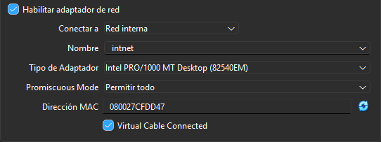
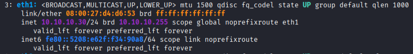
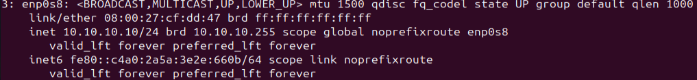
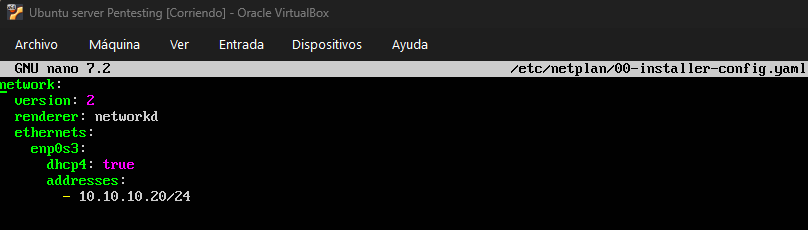
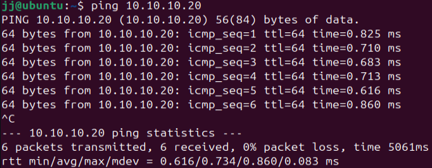
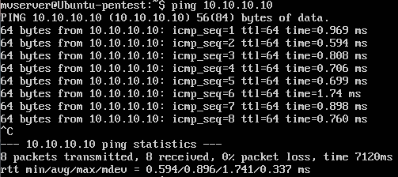
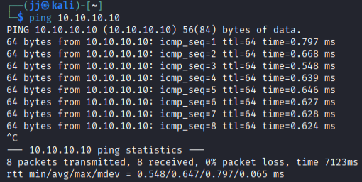
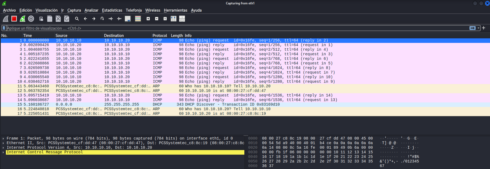

# Configuración inicial del entorno de red y verificación de la conectividad entre máquinas

Antes de llevar a cabo la monitorización de red o un ataque Man-in-the-Middle (MITM), el primer paso es establecer la topología del laboratorio y asegurar que todas las máquinas se puedan comunicar correctamente. En esta parte, hemos configurado tres máquinas virtuales: un atacante (Kali Linux), un cliente (Ubuntu) y un servidor (Ubuntu Server).

## 1. Configuración de Interfaces de Red

Para que las tres maquinas virtuales tengan conectividad entre ellas, se ha configurado una red interna "intnet" en Oracle Virtualbox para cada una de ellas.

El primer paso ha consistido en asignar y verificar las direcciones IP de cada máquina dentro de la misma subred del laboratorio.

- Configuración del Atacante (Kali Linux):
        Comprobamos la interfaz de red en la máquina Kali mediante comandos de terminal con el comando ``ip a``.

  

- Configuración del Cliente (Ubuntu):
    Validamos la configuración de red del equipo de la víctima (cliente) con el comando ``ip a``. Este será el origen de las peticiones hacia los distintos servicios.

  

- Configuración del Servidor (Ubuntu Server):
    Esta será la máquina destino que alojará y responderá a los servicios de la prueba. Comando comando ``ip a``.

  

## 2. Pruebas de Conectividad (ICMP)

Para comprobar que el enrutamiento y los adaptadores de red de las máquinas virtuales están funcionando correctamente en la "intnet", realizamos comprobaciones cruzadas utilizando el comando ping.
  
  - Ping desde el Cliente al Server:
    Verificamos que el cliente es capaz de hacer ping al servidor.

    
  
  - Ping desde el Servidor al Cliente:
   Verificamos que el servidor es capaz de hacer ping al cliente.

    
    
  - Ping desde Kali al Cliente:
    La MV Kali confirma que tiene conectividad con por ejemplo la MV Cliente.

    

## 3. Comprobación a nivel de Paquetes

Como validación final, no solo confiamos en la salida de la terminal, sino que comprobamos a nivel de red qué es lo que está ocurriendo.

En la siguiente imagen, mediante un analizador de protocolos (como Wireshark), capturamos en vivo el flujo de tráfico. Aquí podemos observar claramente los paquetes ICMP (Echo Request y Echo Reply) intercambiándose entre las distintas direcciones IP.

Con la finalización de este proceso, garantizamos que:

    ✅ Las tres máquinas tienen direccionamiento IP válido.

    ✅ Existe conectividad bidireccional entre el cliente, el servidor y el atacante.

    ✅ El tráfico fluye correctamente por lo que estamos preparados para las siguientes partes del laboratorio y comenzar el ataque Man-in-the-Middle sobre distintos protocolos y servicios.
